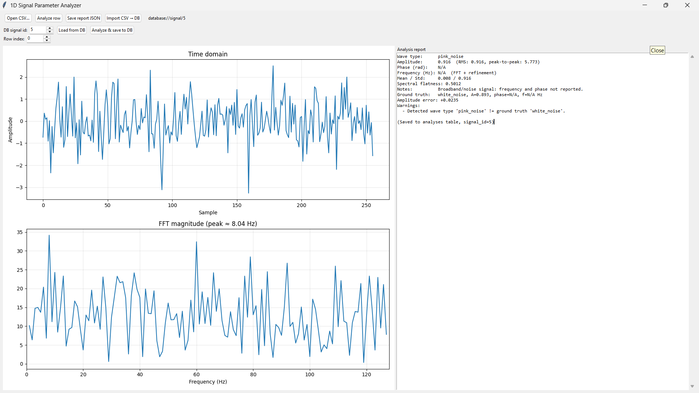

# RNN - Recurrent Neural Networks & Signal Processing

A comprehensive collection of RNN implementations, signal processing utilities, and deep learning models for time series analysis, waveform identification, and regression tasks.

---

## 📑 Table of Contents

- [Project Overview](#project-overview)
- [Project Structure](#project-structure)
- [Installation](#installation)
- [GUI Screenshot](#gui-screenshot)
- [Source Modules](#source-modules)
  - [Signal Analysis Module (NEW)](#signal-analysis-module-new)
  - [Linear Regression Module](#linear-regression-module)
  - [Signal Generation Module](#signal-generation-module)
- [Documentation & Formulas](#documentation--formulas)
- [Notebooks & Experiments](#notebooks--experiments)
- [Performance Benchmarks](#performance-benchmarks)
- [Requirements](#requirements)
- [License](#license)

---

## 🎯 Project Overview

This repository provides a robust framework for:
- **Production-ready PyTorch models** for regression and time series analysis.
- **Advanced Signal Processing**: Identify frequency (FFT) and amplitude from 1D arrays.
- **Signal Generation**: Create synthetic datasets with 17+ waveform types.
- **RNN/GRU/LSTM implementations** from scratch.
- **Video classification** using CRNN architectures.

---

## 📁 Project Structure

```
RNN-main/
│
├── src/
│   ├── identify_amplitude_frequency.py  # NEW: Signal analysis (FFT, Amplitude)
│   ├── linear_regression.py              # Advanced PyTorch regression model
│   ├── dataset.py                        # Signal generation engine
│   ├── multiple_signal.py                # Legacy signal generation utils
│   └── RNN.py                            # RNN/GRU/LSTM implementations
│
├── docs/
│   └── signal_analysis_formulas.md       # Comprehensive mathematical reference
│
├── Notebook/
│   ├── identification.ipynb              # Signal identification & visualization
│   ├── 01- RNN_Classification.ipynb
│   ├── 02- RNN_Regression.ipynb
│   ├── 03- RNN_vs_GRU_Classification.ipynb
│   └── ... (other experiments)
│
├── datasets/                             # CSV datasets for training
├── linear_output/                        # Outputs (incl. GUI screenshot)
│   └── tkinter_output.png
├── data/                                 # SQLite database (signals.db)
└── README.md
```

---

## 🚀 Installation

```bash
# Install core dependencies
pip install torch torchvision numpy pandas matplotlib scipy scikit-learn xgboost jupyter
```

---

## 🔬 Parameter Identification Pipeline

End-to-end workflow for **wave type, amplitude, phase, and frequency** with ground-truth evaluation.

All commands use one entry point: **`python -m src <command>`**

| Command | Action |
|---------|--------|
| `generate` | Create `datasets/train_parameters.csv`, `test_parameters.csv` |
| `analyze --csv FILE --row 0` | Analyze one row, print report |
| `evaluate --csv FILE` | Batch metrics + plots → `outputs/evaluation/` |
| `compare --csv FILE --target frequency` | ML vs pipeline FFT baseline |
| `run-all` | generate → evaluate → compare |
| `gui` | Tkinter upload UI |

```bash
python -m src generate
python -m src evaluate --csv datasets/test_parameters.csv
python -m src analyze --csv datasets/test_parameters.csv --row 0
python -m src compare --csv datasets/test_parameters.csv --target frequency
python -m src gui
```

**Python API** (all routes through `src.pipeline`):

```python
from src.pipeline import analyze_one, evaluate_csv, compare_models, generate_datasets
from src.signal_report import format_report
```

See `implement.md` for architecture and open-dataset suggestions.

---

## GUI Screenshot

Desktop analyzer (`python -m src gui`): time-domain and FFT plots, parameter report, CSV upload, and SQLite import/load.



---

## 📦 Source Modules

### Signal Analysis Module
**Files:** `src/identify_amplitude_frequency.py`, `src/signal_report.py`, `src/evaluate_parameters.py`

- **FFT frequency** with parabolic peak refinement
- **Amplitude & phase** (FFT + sinusoidal least-squares fit)
- **Rule-based wave type** classification
- **Structured reports** and frequency-error plots vs. ground truth

### Model Comparison Framework (NEW)
**File:** `src/comparative_analysis.py`

A comprehensive benchmarking tool that evaluates multiple regression models for signal parameter prediction:
- **Classical ML**: Linear Regression, Ridge, SVR, RandomForest, GradientBoosting, and XGBoost.
- **Deep Learning**: Custom 1D Convolutional Neural Network (PyTorch).
- **Features**: Automatic extraction of 8+ time and frequency domain features.
- **Evaluation**: 5-fold cross-validation and ranked summary table (R2, MAE, RMSE).

### Linear Regression Module
**File:** `src/linear_regression.py`

A production-ready PyTorch regression model featuring:
- 5-layer deep architecture with BatchNorm and Dropout.
- Advanced scheduling (CosineAnnealingWarmRestarts).
- Automatic GPU/CPU detection and data normalization.

---

## 📚 Documentation & Formulas

Detailed mathematical foundations for all metrics and wave generation can be found in:
👉 **[Signal Analysis Formulas & Algorithms](docs/signal_analysis_formulas.md)**

Includes formulas for:
- **Metrics**: RMS, Skewness, Kurtosis, etc.
- **Transformation**: Discrete Fourier Transform (DFT).
- **Generation**: Periodic waves, noise models, and decay functions.

---

### Signal Parameter Regression (Benchmark Results)

The following scores were achieved on a standardized 256-point synthetic sine wave dataset (500 samples, 50-epoch training for CNN):

| Model | Test R² | Test MAE | Test RMSE | Rank |
|-------|---------|----------|-----------|------|
| **Linear Regression** | 0.9998 | 0.0078 | 0.0104 | 1 |
| **Ridge Regression** | 0.9998 | 0.0082 | 0.0110 | 2 |
| **Gradient Boosting** | 0.9996 | 0.0106 | 0.0137 | 3 |
| **Random Forest** | 0.9996 | 0.0109 | 0.0145 | 4 |
| **XGBoost** | 0.9994 | 0.0134 | 0.0181 | 5 |
| **PyTorch 1D CNN** | 0.9965 | 0.0361 | 0.0431 | 6 |
| **SVR (RBF)** | 0.9929 | 0.0448 | 0.0611 | 7 |

---

## 👤 Author
- **Jayesh Pandey**

---

## 📝 License
This project is open source and available under the MIT License.