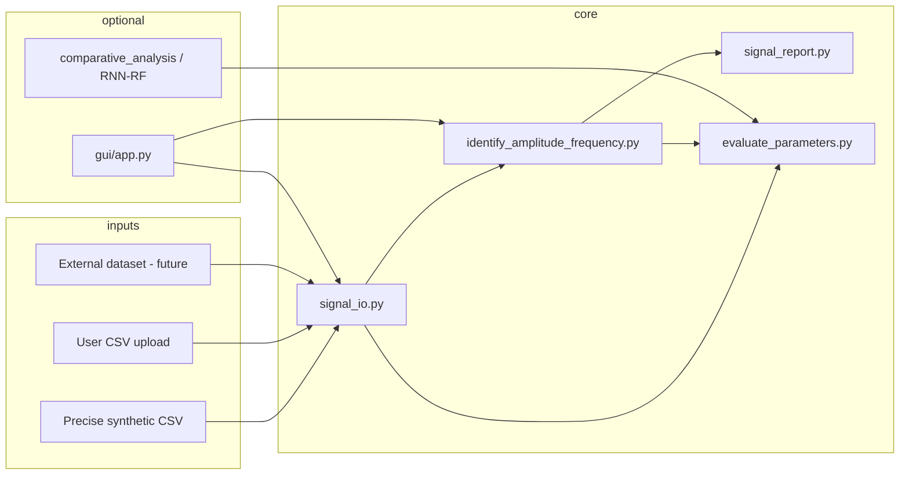

# Implementation Plan — 1D Array Signal Simulation

**Purpose:** Identify **wave type**, **amplitude**, **phase**, and **frequency** from 256-point 1D signals; evaluate accuracy vs. ground truth; support precise datasets and user uploads.

**Conventions:** `Fs = 256 Hz`, `N = 256` samples, `t ∈ [0, 1]` second.

---

## Table of contents

1. [Goals and definition of done](#1-goals-and-definition-of-done)
2. [Current status](#2-current-status)
3. [System architecture](#3-system-architecture)
4. [Data plan](#4-data-plan)
5. [Implementation phases](#5-implementation-phases)
6. [File-by-file responsibilities](#6-file-by-file-responsibilities)
7. [Algorithms and handling rules](#7-algorithms-and-handling-rules)
8. [Testing and acceptance](#8-testing-and-acceptance)
9. [Open decisions](#9-open-decisions)
10. [Suggested order of work](#10-suggested-order-of-work)

---

## 1. Goals and definition of done

### Primary goals

| # | Goal | Success criterion |
|---|------|-------------------|
| G1 | Estimate parameters from any 1D sample | Returns wave type, amplitude, phase (if valid), frequency (if valid) |
| G2 | Structured output | Console text + optional JSON report |
| G3 | Ground-truth comparison | When CSV has labels, show error in Hz and % |
| G4 | Evaluation plots | Detected vs. actual frequency; error vs. actual; error histogram |
| G5 | Precise datasets | Synthetic data stores exact `frequency`, `amplitude`, `phase`, `snr_db` |
| G6 | User upload | Load CSV → analyze (GUI or CLI) |

### Example report (target format)

```text
Wave type:       sine
Amplitude:       1.00  (RMS: 0.71, peak-to-peak: 2.00)
Phase (rad):     0.785
Frequency (Hz):  3.00
Ground truth:    sine, A=1.0, phase=0.785, f=3.0 Hz
Frequency error: +0.00 Hz (+0.00%)
```

### Out of scope (unless explicitly requested later)

- FPGA deployment of parameter estimators
- Full PhysioNet / UCR pipeline automation
- Replacing all legacy RNN notebooks

---

## 2. Current status

### Done (baseline pipeline)

| Component | File(s) | Notes |
|-----------|---------|-------|
| Constants | `src/constants.py` | `SAMPLE_RATE`, wave type lists |
| Precise data generation | `src/precise_dataset.py` | Grid + random; metadata columns |
| Dataset metadata export | `src/dataset.py` | `save_to_csv` includes ground truth |
| CSV I/O | `src/signal_io.py` | Load, validate, resample |
| Parameter estimation | `src/identify_amplitude_frequency.py` | FFT + parabolic peak, phase fit, rule-based wave type |
| Reporting | `src/signal_report.py` | Text + JSON |
| Batch evaluation | `src/evaluate_parameters.py` | Metrics + plots |
| Dataset script | `scripts/generate_datasets.py` | Writes `datasets/*.csv` |
| GUI (v1) | `src/gui/app.py` | Tkinter upload + analyze |
| Docs | `README.md`, `docs/signal_analysis_formulas.md` | Pipeline commands |

### Partial / needs improvement

| Area | Issue | Planned fix (phase) |
|------|-------|---------------------|
| Wave type | Sine vs. cosine ambiguity; harmonics on square/sawtooth | Phase B: ML classifier or better rules |
| Spectral flatness | Still high for pure tones in some cases | Phase B: refine noise detection |
| `comparative_analysis.py` | Not wired to a single CLI entry | Phase C: runner script + notebook |
| Legacy duplication | `multiple_signal.py`, `model_tranning.py` | Phase D: deprecate or merge |
| Notebooks | No `parameter_identification.ipynb` | Phase C |
| External data | No loader yet | Phase E |
| Unit tests | None | Phase F |

### Not started

- Trained waveform classifier hooked into `classify_wave_type()`
- PhysioNet / real-data demo loader
- SNR vs. error plots in evaluation
- PyQt / Streamlit GUI alternative
- Automated CI test run

---

## 3. System architecture



### Design principles

1. **FFT + curve fit first** — fast, interpretable baseline for periodic waves.
2. **ML second** — classification (wave type) and regression (freq/amp) only where rules fail.
3. **Single source of truth for data** — `precise_dataset.py` for benchmarks; `dataset.py` for full 15-class sets.
4. **Never report bogus phase/frequency** on noise and decay signals — use `N/A` and a clear note.

---

## 4. Data plan

### Tier A — Precise synthetic (primary for benchmarking)

**Use for:** frequency-error plots, amplitude/phase regression, reproducible papers/demos.

| Parameter | Values |
|-----------|--------|
| `frequency` | 1, 2, 3, 4, 5 Hz |
| `amplitude` | 0.5, 1.0, 1.5 |
| `phase` | 0, π/4, π/2, π rad |
| `snr_db` | clean, 40, 30, 20, 10 dB |
| Periodic types | sine, cosine, square, triangle, sawtooth, pulse_triangle |

**CSV schema:**

```
wave_type, frequency, amplitude, phase, snr_db, signal_0, signal_1, ... signal_255
```

**Outputs:**

- `datasets/train_parameters.csv`
- `datasets/test_parameters.csv`
- `datasets/train_waveforms.csv` / `test_waveforms.csv` (classification)

**Generation command:**

```bash
python scripts/generate_datasets.py
```

### Tier B — Custom config (single experiments)

JSON example (`configs/example_sine.json`):

```json
{
  "wave_type": "sine",
  "frequency": 3.0,
  "amplitude": 1.0,
  "phase": 0.785,
  "snr_db": null
}
```

API: `precise_dataset.generate_from_config_file(path, output_csv)`.

### Tier C — Open-source real data (validation only)

| Dataset | URL | Use | Limitation |
|---------|-----|-----|------------|
| UCR Time Series | timeseriesclassification.com | Wave **classification** | No standard f, A, φ |
| PTB-XL (ECG) | physionet.org/content/ptb-xl | Dominant **rate** check | Not a pure sinusoid |
| BIDMC PPG/Resp | physionet.org/content/bidmc | Respiration frequency | Must resample to 256 |
| CWRU bearing | case.edu/bearingdatacenter | Vibration FFT peak | No analytic ground truth |

**Rule:** Use Tier C for **realism demos** only; use Tier A for **numeric accuracy claims**.

### Tier D — User upload

**Minimum CSV:** one row = one signal (`signal_0` … `signal_255` or numeric columns).

**Optional columns:** `wave_type`, `frequency`, `amplitude`, `phase` → enables error metrics in GUI/eval.

**Validation:** finite values; length 256 or auto-resample; clear error messages.

---

## 5. Implementation phases

### Phase A — Core pipeline ✅ (complete)

**Objective:** End-to-end synthetic data → analyze → report → evaluate.

| Task | Deliverable | Status |
|------|-------------|--------|
| A1 | `precise_dataset.py` + grid/random | Done |
| A2 | `signal_io.py` | Done |
| A3 | `analyze_signal_full()` + `SignalAnalysisResult` | Done |
| A4 | `signal_report.py` | Done |
| A5 | `evaluate_parameters.py` + plots | Done |
| A6 | `scripts/generate_datasets.py` | Done |
| A7 | Tkinter GUI v1 | Done |

**Acceptance:** `python -m src.evaluate_parameters --csv datasets/test_parameters.csv` runs; MAE &lt; 0.2 Hz on clean periodic subset.

---

### Phase B — Estimation quality (next priority)

**Objective:** More reliable wave type and parameters on all 15 waveform types.

| Task | Description | Files |
|------|-------------|-------|
| B1 | Fix spectral flatness / noise vs. tone detection | `identify_amplitude_frequency.py` |
| B2 | Harmonic-aware fundamental for square, triangle, sawtooth | same |
| B3 | Sine/cosine disambiguation via phase-aware template | same |
| B4 | Explicit `N/A` for non-periodic types in report | `signal_report.py` |
| B5 | SNR vs. frequency-error plot | `evaluate_parameters.py` |

**Acceptance:**

- Clean sine: \|Δf\| &lt; 0.05 Hz, \|ΔA\| &lt; 5%
- Square at 3 Hz: fundamental within 0.1 Hz of truth
- White noise: frequency and phase reported as N/A

---

### Phase C — ML integration and notebooks

**Objective:** Compare FFT baseline vs. ML; document in notebook.

| Task | Description | Files |
|------|-------------|-------|
| C1 | CLI: `python -m src.run_comparison --target frequency` | new `src/run_comparison.py` |
| C2 | Wire `comparative_analysis.evaluate_fft_baseline()` | `comparative_analysis.py` |
| C3 | Notebook: generate → eval → ML compare | `Notebook/parameter_identification.ipynb` |
| C4 | Export comparison table to `outputs/comparison/` | runner script |

**Acceptance:** One notebook runs top-to-bottom; table shows FFT vs. LinearRegression vs. CNN on `test_parameters.csv`.

---

### Phase D — Repo cleanup

**Objective:** One clear path per task; less confusion for new users.

| Task | Action |
|------|--------|
| D1 | Mark `multiple_signal.py` deprecated; point to `dataset.py` |
| D2 | Remove unused `tensorflow` imports where possible |
| D3 | Align README project tree with actual files |
| D4 | Add `requirements.txt` split: `requirements-core.txt` vs. full |

---

### Phase E — External data loader

**Objective:** One real-data demo without breaking Tier A benchmarks.

| Task | Description |
|------|-------------|
| E1 | `src/external_loaders.py` — download/cache one PhysioNet snippet |
| E2 | Resample to 256 points @ Fs=256 |
| E3 | Report dominant frequency only (no phase claim) |
| E4 | Optional notebook section “Real ECG sample” |

---

### Phase F — Tests and CI

**Objective:** Prevent regressions on core math.

| Test | What it checks |
|------|----------------|
| `test_frequency_sine` | 3 Hz sine → error &lt; 0.05 Hz |
| `test_phase_sine` | known phase within tolerance |
| `test_noise_no_freq` | white noise → frequency is None |
| `test_csv_roundtrip` | generate CSV → load → analyze |
| `test_resample` | length 128 → 256 works |

**Tool:** `pytest` in `tests/`.

---

### Phase G — GUI v2 (optional)

**Objective:** Polished UX after Phase B is stable.

| Option | Pros | Cons |
|--------|------|------|
| **Tkinter** (current) | No extra deps | Basic look |
| **Streamlit** | Fast, good plots | Needs server |
| **PyQt6** | Professional desktop | Heavier dependency |

**Features for v2:**

- Batch analyze entire CSV
- Export all reports to folder
- Inline error plots when ground truth present
- Drag-and-drop

---

## 6. File-by-file responsibilities

### Core (parameter identification)

| File | Responsibility | Depends on |
|------|----------------|------------|
| `src/constants.py` | Fs, length, wave type enums | — |
| `src/precise_dataset.py` | Labeled synthetic data | `dataset.WaveformGenerator` |
| `src/dataset.py` | 15 wave types; PyTorch dataset | scipy, optional torch |
| `src/signal_io.py` | Read/write CSV, validate, resample | pandas, scipy |
| `src/identify_amplitude_frequency.py` | All estimation logic | numpy, scipy |
| `src/signal_report.py` | Formatting only | identify module |
| `src/evaluate_parameters.py` | Batch metrics + plots | identify, signal_io |
| `src/gui/app.py` | Desktop UI | matplotlib, tkinter |

### ML / legacy (separate workflows)

| File | Responsibility |
|------|----------------|
| `src/comparative_analysis.py` | Regress frequency/amplitude via ML features |
| `src/RNN.py`, `src/waveform_models.py` | Sequence / waveform classification |
| `src/check_short_samples.py` | Short-seq FPGA quant experiment |
| `src/noisy_signal_data.py` | RNN seq2seq exercises (unrelated) |
| `src/multiple_signal.py` | **Legacy** — do not extend |

### Scripts and config

| Path | Purpose |
|------|---------|
| `scripts/generate_datasets.py` | Create all default CSVs |
| `configs/example_sine.json` | Single-wave config template |
| `outputs/evaluation/` | Plots and eval CSV (gitignored) |

---

## 7. Algorithms and handling rules

### Frequency

1. Compute FFT; use positive frequencies only; skip DC.
2. Find magnitude peak index \(k\).
3. Refine with **parabolic interpolation** on \(|X[k-1]|, |X[k]|, |X[k+1]|\).
4. \(f = k \cdot F_s / N\).

### Amplitude

| Wave family | Method |
|-------------|--------|
| sine, cosine | \(A \approx 2|X[k]|/N\) blended with LS fit |
| square, triangle, sawtooth | peak-to-peak / 2 (fundamental label) |
| noise | RMS |
| decay, step | RMS only |

### Phase

- Only for periodic sine-like fits: \(\phi\) from `curve_fit` or \(\arg X[k]\).
- Wrap error to \([-\pi, \pi]\) when comparing to ground truth.

### Wave type (rule-based v1 → ML v2)

```
IF strong FFT peak AND high template correlation → periodic template (sine/cos/square/...)
ELIF monotonic decay → exponential / logarithmic decay
ELIF high flatness AND weak peak → white / pink / brownian noise
ELSE → unknown + warning
```

### When to report N/A

| Type | frequency | phase |
|------|-----------|-------|
| white_noise, pink_noise, brownian_noise | N/A | N/A |
| exponential_decay, logarithmic_decay, step_function | N/A | N/A |
| square, triangle, sawtooth | fundamental Hz | approximate / warning |

---

## 8. Testing and acceptance

### Manual checklist

- [ ] `python scripts/generate_datasets.py` completes
- [ ] `python -m src.evaluate_parameters --csv datasets/test_parameters.csv`
- [ ] Plots saved under `outputs/evaluation/`
- [ ] `python src/gui/app.py` loads CSV and shows report
- [ ] Clean 3 Hz sine: frequency error &lt; 0.05 Hz
- [ ] White noise: no false frequency
- [ ] CSV with wrong length resamples or errors clearly

### Target metrics (periodic, clean, test set)

| Metric | Target |
|--------|--------|
| Frequency MAE | &lt; 0.1 Hz |
| Frequency RMSE | &lt; 0.15 Hz |
| Amplitude MAE | &lt; 0.1 (unit scale) |
| Wave type accuracy | &gt; 85% (after Phase B) |

---

## 9. Open decisions

Please confirm before Phase B/C implementation:

| # | Question | Options | Recommendation |
|---|----------|---------|----------------|
| 1 | GUI framework for v2 | Tkinter / Streamlit / PyQt6 | Keep Tkinter unless web demo needed → Streamlit |
| 2 | Wave type in v2 | Rules only / train RF / train RNN | RF on FFT+stats features (fast) |
| 3 | Priority wave types | 6 periodic only / all 15 | All 15; periodic gets full params |
| 4 | External data in v1 | Yes PhysioNet / skip | One ECG snippet in Phase E |
| 5 | Commit `datasets/*.csv` | gitignore vs. sample only | Keep gitignored; ship 50-row `datasets/sample.csv` |

---

## 10. Suggested order of work

```
Phase A  ✅  Core pipeline (DONE)
    ↓
Phase B      Estimation quality (sine/cos, harmonics, SNR plots)
    ↓
Phase F      Unit tests (lock in Phase B)
    ↓
Phase C      ML comparison + notebook
    ↓
Phase D      Repo cleanup
    ↓
Phase E      External data demo (optional)
    ↓
Phase G      GUI v2 (optional)
```

### Effort estimate

| Phase | Effort |
|-------|--------|
| B | 2–3 days |
| C | 1–2 days |
| D | 0.5 day |
| E | 1–2 days |
| F | 1 day |
| G | 2–4 days |

---

## Quick reference commands

```bash
# Generate data
python scripts/generate_datasets.py

# Batch evaluation
python -m src.evaluate_parameters --csv datasets/test_parameters.csv

# Single signal in Python
python -c "from src.identify_amplitude_frequency import analyze_signal_full; ..."

# GUI
python src/gui/app.py
```

---

*Last updated: unified `src.pipeline` + `python -m src` CLI connect all endpoints. Legacy `multiple_signal` is a deprecation shim only.*

### Connected architecture (implemented)

```
python -m src generate     → pipeline.generate_datasets → precise_dataset + dataset
python -m src analyze      → pipeline.analyze_one       → identify + signal_report
python -m src evaluate     → pipeline.evaluate_csv      → analyze + plots
python -m src compare      → pipeline.compare_models    → comparative_analysis + features
python -m src gui          → gui.app                    → pipeline.analyze_one
```

**No duplicate FFT logic:** `features.py` ← `identify_amplitude_frequency.py` ← used by `comparative_analysis` and `pipeline`.
